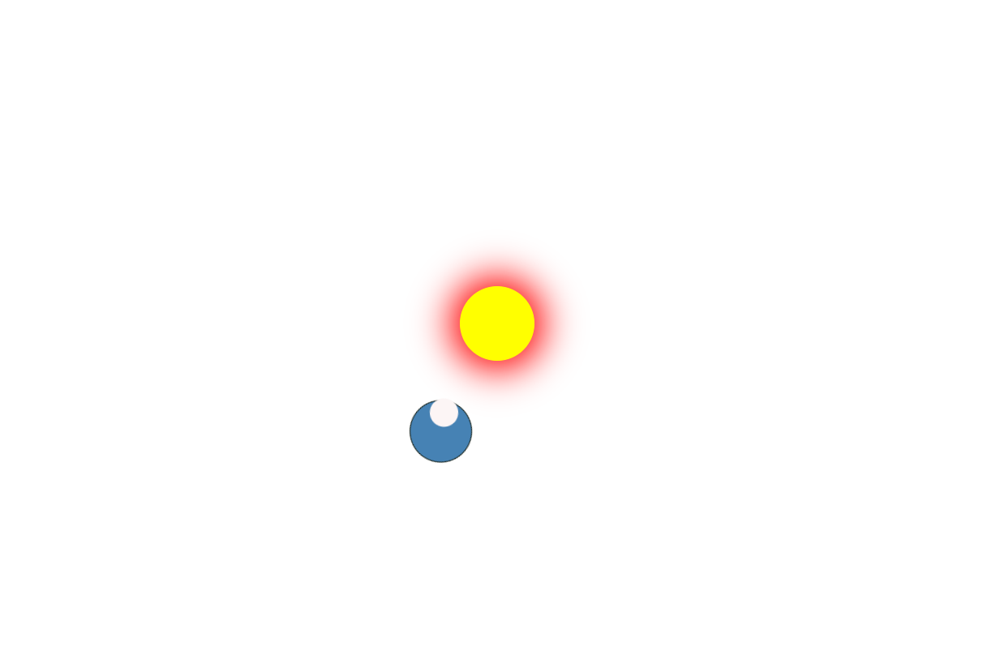

# 🌌 Solar System Animation – HTML & CSS

A beautiful animated model of the solar system built with **pure HTML & CSS**, no JavaScript.  
This project demonstrates creativity using **CSS animations**, **transforms**, and **positioning**.
---

## 🌟 Features

- 🌞 Sun at the center
- 🌍 Orbiting planet with rotation
- 🌙 Orbiting moon around the planet
- 🎥 Smooth infinite animation
- 💡 Built using only HTML & CSS

---

## 💡 What I Learned

- `position: relative` vs `absolute` (parent-child relationships)
- CSS `transform` with `rotate()` and `translate()`
- Using `@keyframes` for circular and elliptical orbits
- Creating a solar system layout using nested divs

---------------------------------------------------
📁 solar-system-animation/ 
├── index.html 
├── style.css 
└── README.md 
------------------------------------------------------
## 📸 Preview

---

## 🚀 Live Demo

[🔗 View it on GitHub Pages](https://yourusername.github.io/solar-system-css-animation)

---

## 🛠️ Tech Stack

- HTML5
- CSS3
- No JavaScript
- No libraries/frameworks

---

## 🔗 Connect with Me

- 🔗 **GitHub**: [github.com/shahijahanQ](https://github.com/shahijahanQ)
- 🐦 **X (Twitter)**: [@shahijahanQ](https://x.com/shahijahanQ)
- 💼 **LinkedIn**: [shahijahan-pedhar](https://linkedin.com/in/shahijahan-pedhar)

## 📌 Note

This was part of my CSS journey (June 18 – July 6, 2025). I’m now starting JavaScript and excited to build interactive versions soon. Stay tuned!

---

👀 *Star this repo if you liked it — and don’t forget to connect!* 🌟

